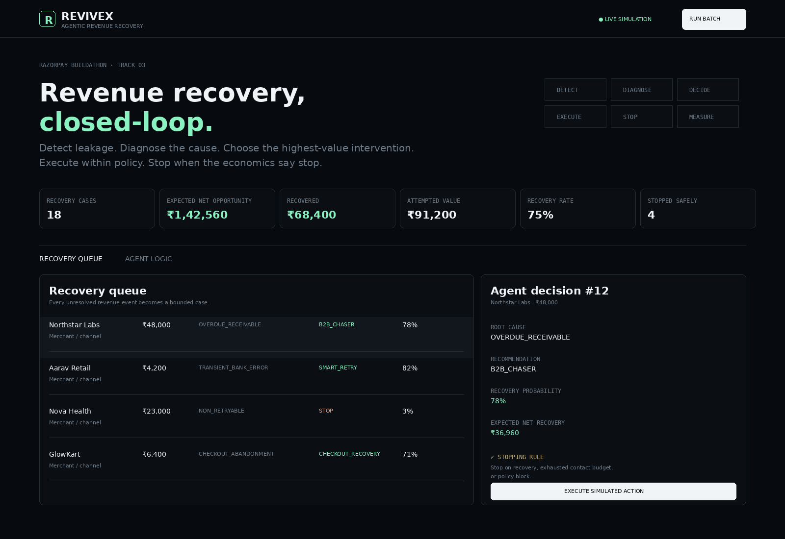
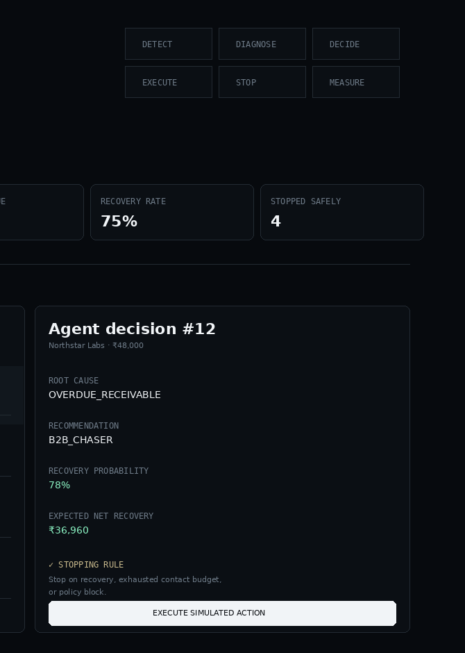
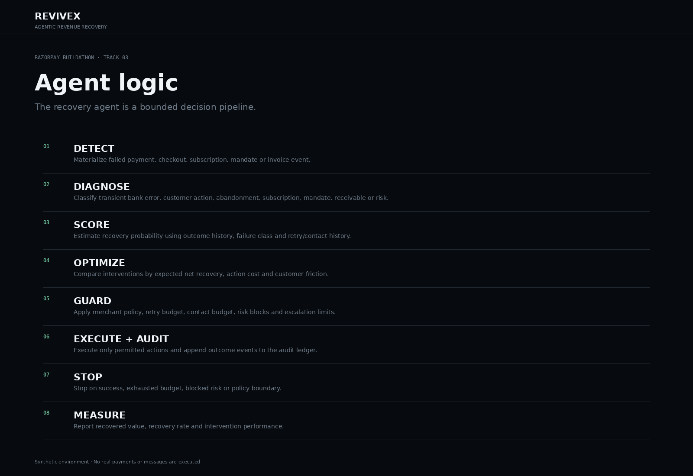

# ReviveX — Agentic Revenue Recovery Control Plane

**Razorpay AI Buildathon · Track 03 — AI Revenue Recovery**

> Detect revenue leakage → diagnose root cause → optimize expected net recovery → execute within policy → reconcile the outcome → stop safely → measure actual recovered money.

ReviveX is a bounded agentic recovery system for failed payments, checkout abandonment, subscriptions, mandates and B2B receivables. The core financial decisioning remains deterministic, explainable and testable; external execution is isolated behind adapters.

## Why this is different

A retry engine asks **“Should I retry?”**. ReviveX asks **“Which policy-eligible intervention maximizes expected net recovery, and when must I stop?”**

**Expected Net Recovery**

`(Recovery Probability × Recoverable Amount) − Action Cost − Customer Friction − Risk Penalty`

The system distinguishes **recovery opportunity**, **expected recovery**, **attempted value**, **pending recovery**, and **actual confirmed recovery**. A Payment Link being created is never counted as recovered money. In Razorpay Test Mode, recovery is confirmed only after reconciliation reports a paid Payment Link. Razorpay Payment Links support API creation and expose states such as `created`, `partially_paid`, `expired`, `cancelled`, and `paid`. (see the official Razorpay Payment Links API documentation: https://razorpay.com/docs/api/payments/payment-links/)

## Core agent loop

```text
EVENT
  ↓
DETECT
  ↓
DIAGNOSE ROOT CAUSE
  ↓
ANALYZE CASE CONTEXT
  ↓
ESTIMATE RECOVERY PROBABILITY
  ↓
CALCULATE EXPECTED NET RECOVERY
  ↓
RANK INTERVENTIONS
  ↓
APPLY MERCHANT + RISK POLICY
  ↓
EXECUTE ONE BOUNDED ACTION
  ↓
RECONCILE / OBSERVE OUTCOME
  ↓
STOP OR ESCALATE
  ↓
MEASURE CONFIRMED RECOVERY
  ↓
APPEND AUDIT EVENT
```

## Architecture

```text
React Control Plane
        │ REST
        ▼
Spring Boot API
        │
        ├── Recovery Orchestrator
        ├── Root Cause Engine
        ├── Recovery Scorer
        ├── Intervention Optimizer
        ├── Policy / Stop Engine
        ├── Recovery Execution Adapter
        │      ├── DemoExecutionAdapter
        │      └── RazorpayExecutionAdapter
        ├── Reconciliation Service
        ├── Webhook Security + Idempotency
        ├── Explanation Service
        └── Append-only Audit Ledger
        │
        ├── H2 Demo
        └── PostgreSQL Production
```

## Screenshots

### Recovery dashboard


### Agent decision inspector


### Agent logic


## Execution modes

### 1. Demo Mode — default

```text
REVIVEX_MODE=demo
```

- no API keys
- deterministic synthetic outcomes
- no real money movement
- reproducible judge demo
- starts immediately after clone

### 2. Razorpay Test Mode

```text
REVIVEX_MODE=razorpay_test
RAZORPAY_KEY_ID=your_test_key
RAZORPAY_KEY_SECRET=your_test_secret
```

Eligible actions create a **Razorpay Test Mode Payment Link** through the official `/v1/payment_links` API. The integration stores the Payment Link ID, short URL and an idempotency reference. Razorpay documents Payment Links as API-created URLs for collecting payments and supports fetching the current link state. (see the official Razorpay Payment Links API documentation: https://razorpay.com/docs/api/payments/payment-links/)

### Honest recovery accounting

```text
Payment Link Created  ≠  Money Recovered

created / pending
        ↓
reconciliation
        ↓
paid + captured amount
        ↓
ACTUAL CONFIRMED RECOVERY
```

## Agentic decisioning

The agent is deliberately bounded. It can observe, diagnose, score, rank, execute one permitted action, reconcile the outcome and stop. It cannot bypass risk policy, retry indefinitely, exceed contact budgets, or continue after a terminal state.

The optional LLM layer is explanation-only in this implementation. If `LLM_ENABLED=false`, deterministic explanations remain available. Financial decisions are not delegated to an uncontrolled model.

## Policy guardrails

Policies cover: retry budget, contact budget, customer nudges, B2B chasing and high-risk blocking. Every decision returns a structured rule and reason, not a bare boolean.

Examples of terminal rules:

- `STOP_RETRY_BUDGET_EXHAUSTED`
- `STOP_CONTACT_BUDGET_EXHAUSTED`
- `STOP_HIGH_RISK`
- `STOP_POLICY_BLOCKED`
- `STOP_AFTER_SUCCESS_OR_POLICY_BOUNDARY`

## State machine

```text
DETECTED → ANALYZED → PLANNED → POLICY_APPROVED
                              ↓
                         ACTION_PENDING
                              ↓
                       ACTION_EXECUTED
                              ↓
                       AWAITING_OUTCOME
                         ↙          ↘
                  RECOVERED      FAILED / EXPIRED / STOPPED / ESCALATED
```

Invalid terminal-state transitions are rejected.

## Audit ledger

Important events include:

`CASE_DETECTED`, `CASE_ANALYZED`, `ACTION_PLANNED`, `POLICY_APPROVED`, `POLICY_BLOCKED`, `ACTION_EXECUTED`, `PAYMENT_CONFIRMED`, `RECOVERY_CONFIRMED`, `CASE_STOPPED`, `EXECUTION_FAILED`, `RECONCILIATION_FAILED`, `WEBHOOK_RECEIVED`.

## API

| Method | Endpoint | Purpose |
|---|---|---|
| GET | `/api/v1/health` | health |
| GET | `/api/v1/system/status` | demo/test/webhook status |
| GET | `/api/v1/dashboard` | recovery KPIs |
| GET | `/api/v1/recovery/cases` | recovery queue |
| GET | `/api/v1/recovery/cases/{id}` | case detail |
| POST | `/api/v1/recovery/run` | run agent batch |
| POST | `/api/v1/recovery/cases/{id}/execute` | execute bounded action |
| POST | `/api/v1/recovery/reconcile` | reconcile pending actions |
| POST | `/api/v1/recovery/cases/{id}/reconcile` | reconcile one case |
| GET | `/api/v1/recovery/cases/{id}/actions` | execution history |
| GET | `/api/v1/recovery/cases/{id}/audit` | case audit |
| GET | `/api/v1/audit` | audit ledger |
| GET | `/api/v1/analytics/actions` | action performance |
| GET | `/api/v1/analytics/root-causes` | root-cause distribution |
| GET | `/api/v1/analytics/recovery-performance` | expected vs actual |
| GET | `/api/v1/analytics/funnel` | recovery funnel |
| GET | `/api/v1/policy` | merchant policies |
| POST | `/api/v1/webhooks/razorpay` | signed webhook receiver |

## Razorpay webhook security

When a webhook secret is configured, ReviveX validates the raw request body using HMAC-SHA256 against `X-Razorpay-Signature`, rejects invalid signatures, deduplicates event IDs and triggers reconciliation. Razorpay documents this raw-body HMAC-SHA256 validation model. (see the official Razorpay webhook validation documentation: https://razorpay.com/docs/webhooks/validate-test/)

```text
RAZORPAY_WEBHOOK_SECRET=your_webhook_secret
```

## Run locally — Windows PowerShell

### Option A — Docker

```powershell
git clone <YOUR_PUBLIC_GITHUB_URL>
cd ReviveX-Final-Razorpay-Buildathon
docker compose up --build
```

Frontend: `http://localhost:5173`

Backend: `http://localhost:8080`

### Option B — local processes

Backend:

```powershell
cd backend
mvn spring-boot:run
```

Frontend:

```powershell
cd frontend
npm install
npm run dev
```

## Test Mode setup

1. Create/use Razorpay Test Mode API credentials.
2. Copy `.env.example` values into your environment.
3. Set `REVIVEX_MODE=razorpay_test`.
4. Start the backend.
5. Run the recovery batch.
6. Execute an eligible case.
7. Open the generated Payment Link.
8. Complete the Test Mode payment.
9. Click **Reconcile Payments** in the control plane.
10. Only then does `Actual Recovered` increase.

Razorpay documents that Payment Links can be created with amount, currency, reference ID, customer details, expiry and other options, and that payment data is populated after successful payment. (official docs: https://razorpay.com/docs/api/payments/payment-links/create-standard/)

## Judge demo flow

1. Open Dashboard.
2. Show `Expected Net Recovery` and `Actual Recovered`.
3. Click **Run Recovery Batch**.
4. Open the ₹48,000 B2B overdue case.
5. Show root cause, probability, intervention ranking and policy.
6. Execute the action.
7. In Demo Mode, show deterministic confirmed recovery.
8. In Razorpay Test Mode, show the Payment Link and explain that recovery is still pending.
9. Complete a test payment and reconcile.
10. Open a retry-exhausted/high-risk case and show the STOP guardrail.
11. Open the audit trail.
12. Return to Dashboard and point to **Actual Recovered**.

## Demo data

The seed set covers transient bank errors, issuer unavailable, insufficient funds, authentication, permanent decline, checkout abandonment, subscription failures, mandate degradation, 15/30/45-day overdue B2B invoices, high-value recovery, fraud/high-risk blocking, exhausted retry/contact budgets, cooldown, dispute and escalation scenarios.

## Security

- `.env` is ignored.
- `.env.example` contains placeholders only.
- No Razorpay credentials are committed.
- Demo mode uses synthetic data.
- Webhook signatures are verified when configured.
- Recovery is not counted from link creation alone.
- Idempotency prevents duplicate execution references.

## Production evolution

For production, the natural next steps are calibrated recovery models, Kafka/event streaming, PostgreSQL, provider-specific adapters, policy-as-code, OpenTelemetry/Prometheus, a durable job scheduler, encrypted secret management, and a proper LLM provider abstraction for unstructured diagnosis and message drafting.

## Limitations

This repository is a buildathon-grade control-plane prototype. Razorpay integration is intentionally isolated to Test Mode. Demo Mode is synthetic. No production money movement, customer messaging, fraud decisioning, or payment credentials are included.

## License

MIT
